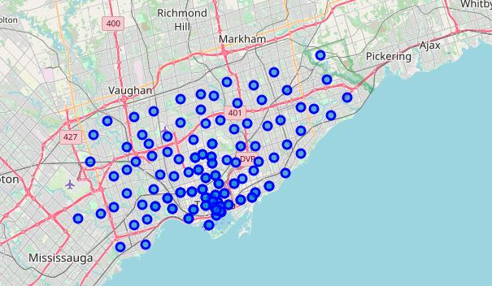

# Coursera - Toronto Neighbourhoods Project

## **About The Project**
-Mandatory student project for IBM's Applied Data Science Certificate.

-Toronto Postal Code Data from Wikipedia url (https://en.wikipedia.org/w/index.php?title=List_of_postal_codes_of_Canada:_M&oldid=890001695) was scraped using BeautifulSoup. Data was then used to create multiple dataframes and basic maps.
  

## **Requirements**
-Python (Pandas, Folium, Geocoder, Nominatim, JSON, CSV, Requests, lxml).

-FourSquare API access.

-Beautiful Soup (for scraping HTML/XML).

## **Instructions**
-All three parts of the project are included in the TorontoPOSTALCODES document.

-File needed is Geospatial_Coordinates.csv (included in this repository).

